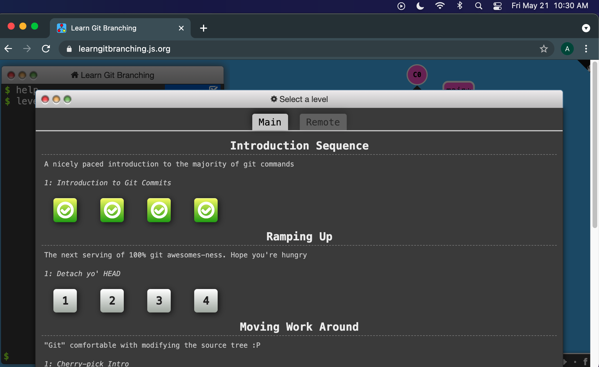

# Git Exercise 2

- [ ]  Go to [https://learngitbranching.js.org/](https://learngitbranching.js.org/)
- [ ]  Complete the first four levels
- [ ]  Once the first four levels are completed, refresh the page
- [ ]  Take a screenshot of this screen, with the time on your system visible in the screenshot. (you need to refresh the browser to get to this page)

    

- [ ]  Share you screenshot in the ramp-team channel on Slack